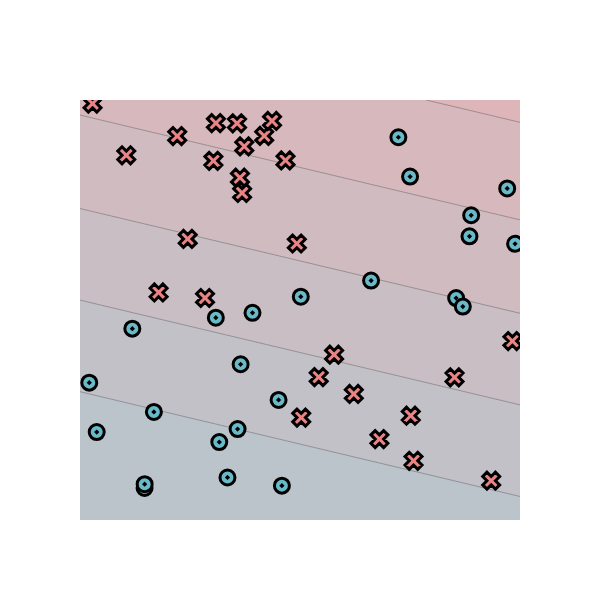

[](https://classroom.github.com/online_ide?assignment_repo_id=13787054&assignment_repo_type=AssignmentRepo)
# MiniTorch Module 1


* Docs: https://minitorch.github.io/

* Overview: https://minitorch.github.io/module1/module1/

This assignment requires the following files from the previous assignments. You can get these by running

```bash
python sync_previous_module.py previous-module-dir current-module-dir
```

The files that will be synced are:

        minitorch/operators.py minitorch/module.py tests/test_module.py tests/test_operators.py project/run_manual.py

## Simple
PTS: 50, HIDDEN: 2, RATE: 0.5
```
Epoch: 0/500, loss: 0, correct: 0
Epoch: 0/500, loss: 0, correct: 0
Epoch: 10/500, loss: 35.3563081048573, correct: 24
Epoch: 20/500, loss: 34.39850330576266, correct: 24
Epoch: 30/500, loss: 33.67038039453335, correct: 24
Epoch: 40/500, loss: 33.08707579781624, correct: 24
Epoch: 50/500, loss: 32.58108878442183, correct: 39
Epoch: 60/500, loss: 32.10100185401967, correct: 45
Epoch: 70/500, loss: 31.6174756875257, correct: 48
Epoch: 80/500, loss: 31.093529880615698, correct: 49
Epoch: 90/500, loss: 30.50450170373471, correct: 49
Epoch: 100/500, loss: 29.847643198637968, correct: 49
Epoch: 110/500, loss: 29.128062211033896, correct: 49
Epoch: 120/500, loss: 28.328972568685288, correct: 49
Epoch: 130/500, loss: 27.44086674117978, correct: 49
Epoch: 140/500, loss: 26.530034035690836, correct: 49
Epoch: 150/500, loss: 25.699930709090694, correct: 49
Epoch: 160/500, loss: 24.959767718318524, correct: 47
Epoch: 170/500, loss: 24.2392783493541, correct: 47
Epoch: 180/500, loss: 23.557785859750403, correct: 46
Epoch: 190/500, loss: 22.889328305967798, correct: 46
Epoch: 200/500, loss: 22.216513519294853, correct: 46
Epoch: 210/500, loss: 21.57148559023875, correct: 46
Epoch: 220/500, loss: 20.933999911635368, correct: 46
Epoch: 230/500, loss: 20.32254760833038, correct: 46
Epoch: 240/500, loss: 19.715819923329676, correct: 46
Epoch: 250/500, loss: 19.123709241921084, correct: 46
Epoch: 260/500, loss: 18.570970881983566, correct: 46
Epoch: 270/500, loss: 18.04089839756526, correct: 46
Epoch: 280/500, loss: 17.525000182742662, correct: 46
Epoch: 290/500, loss: 17.03701674932441, correct: 47
Epoch: 300/500, loss: 16.560366813094067, correct: 47
Epoch: 310/500, loss: 16.094431423419802, correct: 47
Epoch: 320/500, loss: 15.645595417589501, correct: 47
Epoch: 330/500, loss: 15.211425924859485, correct: 47
Epoch: 340/500, loss: 14.808368107282366, correct: 47
Epoch: 350/500, loss: 14.422411677928833, correct: 47
Epoch: 360/500, loss: 14.048889264285009, correct: 47
Epoch: 370/500, loss: 13.68577287954328, correct: 47
Epoch: 380/500, loss: 13.33289842420046, correct: 48
Epoch: 390/500, loss: 12.990272506623786, correct: 48
Epoch: 400/500, loss: 12.657898564632772, correct: 48
Epoch: 410/500, loss: 12.335764948363686, correct: 49
Epoch: 420/500, loss: 12.023840963660374, correct: 49
Epoch: 430/500, loss: 11.72207378813058, correct: 49
Epoch: 440/500, loss: 11.430386181049496, correct: 49
Epoch: 450/500, loss: 11.148781866301007, correct: 49
Epoch: 460/500, loss: 10.883836622837368, correct: 49
Epoch: 470/500, loss: 10.634545829872092, correct: 49
Epoch: 480/500, loss: 10.394886794491814, correct: 49
Epoch: 490/500, loss: 10.164370417482807, correct: 49
Epoch: 500/500, loss: 9.944734537399782, correct: 49
```


```
Epoch: 0/500, loss: 0, correct: 0
Epoch: 0/500, loss: 0, correct: 0
Epoch: 0/500, loss: 0, correct: 0
Epoch: 0/500, loss: 0, correct: 0
Epoch: 10/500, loss: 29.12828083417172, correct: 35
Epoch: 20/500, loss: 28.14434410768319, correct: 34
Epoch: 30/500, loss: 27.41220684163904, correct: 37
Epoch: 40/500, loss: 26.80933832939876, correct: 38
Epoch: 50/500, loss: 26.24903068599408, correct: 37
Epoch: 60/500, loss: 25.706994330034693, correct: 37
Epoch: 70/500, loss: 25.178084188427622, correct: 39
Epoch: 80/500, loss: 24.640429162875858, correct: 39
Epoch: 90/500, loss: 24.11950224637375, correct: 39
Epoch: 100/500, loss: 23.613155665844673, correct: 39
Epoch: 110/500, loss: 23.122301338278543, correct: 39
Epoch: 120/500, loss: 22.649105805529903, correct: 39
Epoch: 130/500, loss: 22.189342296491727, correct: 39
Epoch: 140/500, loss: 21.743927939795626, correct: 40
Epoch: 150/500, loss: 21.31017926703686, correct: 40
Epoch: 160/500, loss: 20.88735334411522, correct: 40
Epoch: 170/500, loss: 20.4747046627457, correct: 40
Epoch: 180/500, loss: 20.074622319111402, correct: 40
Epoch: 190/500, loss: 19.685278963344867, correct: 41
Epoch: 200/500, loss: 19.30539578046016, correct: 41
Epoch: 210/500, loss: 18.93497046854651, correct: 41
Epoch: 220/500, loss: 18.57157990125192, correct: 41
Epoch: 230/500, loss: 18.215926877337356, correct: 41
Epoch: 240/500, loss: 17.868537611737224, correct: 42
Epoch: 250/500, loss: 17.528100447052598, correct: 42
Epoch: 260/500, loss: 17.195353945357866, correct: 42
Epoch: 270/500, loss: 16.869211837087736, correct: 42
Epoch: 280/500, loss: 16.548952804749337, correct: 42
Epoch: 290/500, loss: 16.23427403513729, correct: 42
Epoch: 300/500, loss: 15.925214398577985, correct: 42
Epoch: 310/500, loss: 15.62204040978137, correct: 42
Epoch: 320/500, loss: 15.324551079574205, correct: 42
Epoch: 330/500, loss: 15.032659850743006, correct: 42
Epoch: 340/500, loss: 14.746396780093518, correct: 43
Epoch: 350/500, loss: 14.46606490250058, correct: 44
Epoch: 360/500, loss: 14.19144342652285, correct: 44
Epoch: 370/500, loss: 13.922993580664373, correct: 44
Epoch: 380/500, loss: 13.660173981491905, correct: 44
Epoch: 390/500, loss: 13.403111764020741, correct: 45
Epoch: 400/500, loss: 13.151643372296242, correct: 45
Epoch: 410/500, loss: 12.905940525240487, correct: 45
Epoch: 420/500, loss: 12.666929334697851, correct: 45
Epoch: 430/500, loss: 12.433675619748007, correct: 45
Epoch: 440/500, loss: 12.205919536306576, correct: 45
Epoch: 450/500, loss: 11.983787105639538, correct: 45
Epoch: 460/500, loss: 11.767091852989648, correct: 46
Epoch: 470/500, loss: 11.555928292680802, correct: 46
Epoch: 480/500, loss: 11.3506603837879, correct: 47
Epoch: 490/500, loss: 11.150876623267575, correct: 47
Epoch: 500/500, loss: 10.956375541591282, correct: 47
```


## Diag
PTS: 50, HIDDEN: 2, RATE: 0.5
```
Epoch: 0/500, loss: 0, correct: 0
Epoch: 0/500, loss: 0, correct: 0
Epoch: 10/500, loss: 28.61617836566078, correct: 43
Epoch: 20/500, loss: 25.56805211969085, correct: 43
Epoch: 30/500, loss: 23.58512663091301, correct: 43
Epoch: 40/500, loss: 22.325252830140354, correct: 43
Epoch: 50/500, loss: 21.536109560373802, correct: 43
Epoch: 60/500, loss: 21.044125037123873, correct: 43
Epoch: 70/500, loss: 20.737343602197896, correct: 43
Epoch: 80/500, loss: 20.544911592399178, correct: 43
Epoch: 90/500, loss: 20.423098153007327, correct: 43
Epoch: 100/500, loss: 20.345848123869377, correct: 43
Epoch: 110/500, loss: 20.295641214177238, correct: 43
Epoch: 120/500, loss: 20.25991167435948, correct: 43
Epoch: 130/500, loss: 20.232184219511257, correct: 43
Epoch: 140/500, loss: 20.209225532038264, correct: 43
Epoch: 150/500, loss: 20.190751356729063, correct: 43
Epoch: 160/500, loss: 20.1752324651624, correct: 43
Epoch: 170/500, loss: 20.162654008237872, correct: 43
Epoch: 180/500, loss: 20.151064863510175, correct: 43
Epoch: 190/500, loss: 20.140025031303814, correct: 43
Epoch: 200/500, loss: 20.128777174356813, correct: 43
Epoch: 210/500, loss: 20.117444521285503, correct: 43
Epoch: 220/500, loss: 20.10648513381731, correct: 43
Epoch: 230/500, loss: 20.09619981777554, correct: 43
Epoch: 240/500, loss: 20.08617457374398, correct: 43
Epoch: 250/500, loss: 20.076134458345273, correct: 43
Epoch: 260/500, loss: 20.066136888183365, correct: 43
Epoch: 270/500, loss: 20.055702470937167, correct: 43
Epoch: 280/500, loss: 20.044867657178745, correct: 43
Epoch: 290/500, loss: 20.03354904567783, correct: 43
Epoch: 300/500, loss: 20.021597343981277, correct: 43
Epoch: 310/500, loss: 20.0091823109926, correct: 43
Epoch: 320/500, loss: 19.996118529505065, correct: 43
Epoch: 330/500, loss: 19.982329159291293, correct: 43
Epoch: 340/500, loss: 19.967753215955987, correct: 43
Epoch: 350/500, loss: 19.952343290762585, correct: 43
Epoch: 360/500, loss: 19.93618284699956, correct: 43
Epoch: 370/500, loss: 19.91911381959, correct: 43
Epoch: 380/500, loss: 19.90105385642628, correct: 43
Epoch: 390/500, loss: 19.88193865908684, correct: 43
Epoch: 400/500, loss: 19.861699206205476, correct: 43
Epoch: 410/500, loss: 19.84026132519251, correct: 43
Epoch: 420/500, loss: 19.81754523187578, correct: 43
Epoch: 430/500, loss: 19.793465031419366, correct: 43
Epoch: 440/500, loss: 19.76792817455718, correct: 43
Epoch: 450/500, loss: 19.740834863455945, correct: 43
Epoch: 460/500, loss: 19.71214865439331, correct: 43
Epoch: 470/500, loss: 19.68195656408184, correct: 43
Epoch: 480/500, loss: 19.649896114830305, correct: 43
Epoch: 490/500, loss: 19.615999802943055, correct: 43
Epoch: 500/500, loss: 19.580136664662753, correct: 43
```


PTS: 50, HIDDEN: 10, RATE: 0.5
```
Epoch: 0/500, loss: 0, correct: 0
Epoch: 10/500, loss: 23.774728444462568, correct: 44
Epoch: 20/500, loss: 16.84182930669287, correct: 43
Epoch: 30/500, loss: 14.813812469088697, correct: 43
Epoch: 40/500, loss: 14.01082934228208, correct: 43
Epoch: 50/500, loss: 13.569395991065697, correct: 43
Epoch: 60/500, loss: 13.251429965106247, correct: 43
Epoch: 70/500, loss: 12.99457149740549, correct: 43
Epoch: 80/500, loss: 12.77396219181211, correct: 43
Epoch: 90/500, loss: 12.56594723625852, correct: 43
Epoch: 100/500, loss: 12.373290567595147, correct: 43
Epoch: 110/500, loss: 12.188265281239943, correct: 43
Epoch: 120/500, loss: 12.010645052150105, correct: 43
Epoch: 130/500, loss: 11.838844135767884, correct: 43
Epoch: 140/500, loss: 11.672885389995507, correct: 43
Epoch: 150/500, loss: 11.511320587210895, correct: 43
Epoch: 160/500, loss: 11.344733284581944, correct: 43
Epoch: 170/500, loss: 11.17605533237918, correct: 43
Epoch: 180/500, loss: 11.00978149730935, correct: 43
Epoch: 190/500, loss: 10.847424806481737, correct: 43
Epoch: 200/500, loss: 10.686970291654793, correct: 43
Epoch: 210/500, loss: 10.526042838308763, correct: 43
Epoch: 220/500, loss: 10.374647522262125, correct: 43
Epoch: 230/500, loss: 10.250966081772068, correct: 43
Epoch: 240/500, loss: 10.123200130639912, correct: 43
Epoch: 250/500, loss: 9.997651111362824, correct: 44
Epoch: 260/500, loss: 9.875267779454317, correct: 44
Epoch: 270/500, loss: 9.74717534373107, correct: 44
Epoch: 280/500, loss: 9.61563380902512, correct: 45
Epoch: 290/500, loss: 9.484003318600816, correct: 45
Epoch: 300/500, loss: 9.354281798312364, correct: 45
Epoch: 310/500, loss: 9.226305495635142, correct: 45
Epoch: 320/500, loss: 9.100038838055664, correct: 45
Epoch: 330/500, loss: 8.975450444296307, correct: 45
Epoch: 340/500, loss: 8.852530088658485, correct: 45
Epoch: 350/500, loss: 8.731264259375916, correct: 45
Epoch: 360/500, loss: 8.611636255871845, correct: 45
Epoch: 370/500, loss: 8.493631241844069, correct: 45
Epoch: 380/500, loss: 8.375224751105886, correct: 45
Epoch: 390/500, loss: 8.255333541051066, correct: 46
Epoch: 400/500, loss: 8.136559730588514, correct: 46
Epoch: 410/500, loss: 8.01962935927366, correct: 46
Epoch: 420/500, loss: 7.904542578281666, correct: 46
Epoch: 430/500, loss: 7.791366666152234, correct: 47
Epoch: 440/500, loss: 7.680055075805915, correct: 47
Epoch: 450/500, loss: 7.567906719621836, correct: 47
Epoch: 460/500, loss: 7.45715460257176, correct: 47
Epoch: 470/500, loss: 7.348284832366627, correct: 47
Epoch: 480/500, loss: 7.239660754297865, correct: 48
Epoch: 490/500, loss: 7.131524841145719, correct: 48
Epoch: 500/500, loss: 7.025457250103423, correct: 48
```


## Split
PTS: 50, HIDDEN: 2, RATE: 0.5
```
Epoch: 0/500, loss: 0, correct: 0
Epoch: 0/500, loss: 0, correct: 0
Epoch: 10/500, loss: 35.5259689440399, correct: 20
Epoch: 20/500, loss: 34.86119638739916, correct: 20
Epoch: 30/500, loss: 34.44529320212665, correct: 30
Epoch: 40/500, loss: 34.17885424189478, correct: 30
Epoch: 50/500, loss: 34.00510280907832, correct: 30
Epoch: 60/500, loss: 33.89024988009538, correct: 30
Epoch: 70/500, loss: 33.81353238396795, correct: 30
Epoch: 80/500, loss: 33.76186825436918, correct: 30
Epoch: 90/500, loss: 33.72685143184639, correct: 30
Epoch: 100/500, loss: 33.70299608313289, correct: 30
Epoch: 110/500, loss: 33.68667778050228, correct: 30
Epoch: 120/500, loss: 33.675478246479585, correct: 30
Epoch: 130/500, loss: 33.66777117795939, correct: 30
Epoch: 140/500, loss: 33.66245588732369, correct: 30
Epoch: 150/500, loss: 33.65878356677789, correct: 30
Epoch: 160/500, loss: 33.65624264838813, correct: 30
Epoch: 170/500, loss: 33.65448243773556, correct: 30
Epoch: 180/500, loss: 33.653261845564636, correct: 30
Epoch: 190/500, loss: 33.65241474783657, correct: 30
Epoch: 200/500, loss: 33.65182645716855, correct: 30
Epoch: 210/500, loss: 33.65141767180174, correct: 30
Epoch: 220/500, loss: 33.651133486256555, correct: 30
Epoch: 230/500, loss: 33.650935845064204, correct: 30
Epoch: 240/500, loss: 33.6507983480382, correct: 30
Epoch: 250/500, loss: 33.6507026669941, correct: 30
Epoch: 260/500, loss: 33.65063606983643, correct: 30
Epoch: 270/500, loss: 33.65058970738256, correct: 30
Epoch: 280/500, loss: 33.65055742656253, correct: 30
Epoch: 290/500, loss: 33.6505349474641, correct: 30
Epoch: 300/500, loss: 33.650519292212316, correct: 30
Epoch: 310/500, loss: 33.65050838835205, correct: 30
Epoch: 320/500, loss: 33.650500793259624, correct: 30
Epoch: 330/500, loss: 33.65049550256115, correct: 30
Epoch: 340/500, loss: 33.65049181689818, correct: 30
Epoch: 350/500, loss: 33.6504892492404, correct: 30
Epoch: 360/500, loss: 33.65048746038838, correct: 30
Epoch: 370/500, loss: 33.65048621408186, correct: 30
Epoch: 380/500, loss: 33.65048534574889, correct: 30
Epoch: 390/500, loss: 33.6504847407468, correct: 30
Epoch: 400/500, loss: 33.65048431921038, correct: 30
Epoch: 410/500, loss: 33.65048402549964, correct: 30
Epoch: 420/500, loss: 33.65048382085064, correct: 30
Epoch: 430/500, loss: 33.650483678255696, correct: 30
Epoch: 440/500, loss: 33.6504835788978, correct: 30
Epoch: 450/500, loss: 33.6504835096664, correct: 30
Epoch: 460/500, loss: 33.65048346142637, correct: 30
Epoch: 470/500, loss: 33.650483427812944, correct: 30
Epoch: 480/500, loss: 33.65048340439108, correct: 30
Epoch: 490/500, loss: 33.650483388070725, correct: 30
Epoch: 500/500, loss: 33.65048337669863, correct: 30
```


PTS: 50, HIDDEN: 10, RATE: 0.5
```
Epoch: 0/500, loss: 0, correct: 0
Epoch: 10/500, loss: 34.19501364953922, correct: 26
Epoch: 20/500, loss: 33.300162840389916, correct: 30
Epoch: 30/500, loss: 33.08125627734438, correct: 30
Epoch: 40/500, loss: 32.90300913683401, correct: 30
Epoch: 50/500, loss: 32.70498341141999, correct: 30
Epoch: 60/500, loss: 32.56855623828121, correct: 30
Epoch: 70/500, loss: 32.457479610970424, correct: 30
Epoch: 80/500, loss: 32.36484496458384, correct: 30
Epoch: 90/500, loss: 32.27382900338817, correct: 30
Epoch: 100/500, loss: 32.1844863255387, correct: 30
Epoch: 110/500, loss: 32.10075543987372, correct: 30
Epoch: 120/500, loss: 32.01900675566585, correct: 30
Epoch: 130/500, loss: 31.930156175787744, correct: 30
Epoch: 140/500, loss: 31.83591610668764, correct: 30
Epoch: 150/500, loss: 31.73512006435646, correct: 30
Epoch: 160/500, loss: 31.63238650205784, correct: 30
Epoch: 170/500, loss: 31.53110497198865, correct: 31
Epoch: 180/500, loss: 31.429118341581386, correct: 31
Epoch: 190/500, loss: 31.326732304130864, correct: 31
Epoch: 200/500, loss: 31.22556622351901, correct: 31
Epoch: 210/500, loss: 31.123804069842446, correct: 31
Epoch: 220/500, loss: 31.0192753666024, correct: 31
Epoch: 230/500, loss: 30.911503579148146, correct: 31
Epoch: 240/500, loss: 30.801981982343534, correct: 31
Epoch: 250/500, loss: 30.690456710163158, correct: 32
Epoch: 260/500, loss: 30.57322934424831, correct: 32
Epoch: 270/500, loss: 30.451634304256753, correct: 32
Epoch: 280/500, loss: 30.32571611351639, correct: 32
Epoch: 290/500, loss: 30.198585901215033, correct: 32
Epoch: 300/500, loss: 30.068800934786896, correct: 34
Epoch: 310/500, loss: 29.933550548743497, correct: 34
Epoch: 320/500, loss: 29.793369376253434, correct: 36
Epoch: 330/500, loss: 29.6474840748287, correct: 37
Epoch: 340/500, loss: 29.49716351896898, correct: 38
Epoch: 350/500, loss: 29.343714198805436, correct: 39
Epoch: 360/500, loss: 29.18510290771508, correct: 39
Epoch: 370/500, loss: 29.019831075524884, correct: 40
Epoch: 380/500, loss: 28.847604534667365, correct: 40
Epoch: 390/500, loss: 28.66858380767387, correct: 41
Epoch: 400/500, loss: 28.481554736978023, correct: 41
Epoch: 410/500, loss: 28.286751370488123, correct: 41
Epoch: 420/500, loss: 28.08770223547919, correct: 41
Epoch: 430/500, loss: 27.87657186986277, correct: 41
Epoch: 440/500, loss: 27.65311843571203, correct: 41
Epoch: 450/500, loss: 27.418880634865513, correct: 41
Epoch: 460/500, loss: 27.184608296933693, correct: 41
Epoch: 470/500, loss: 26.944707234165886, correct: 41
Epoch: 480/500, loss: 26.69904524100281, correct: 41
Epoch: 490/500, loss: 26.44734392383716, correct: 41
Epoch: 500/500, loss: 26.185978869667494, correct: 41
```


## Xor
PTS: 50, HIDDEN: 2, RATE: 0.5
```
Epoch: 0/500, loss: 0, correct: 0
Epoch: 0/500, loss: 0, correct: 0
Epoch: 10/500, loss: 35.89255141127787, correct: 26
Epoch: 20/500, loss: 35.15109328153239, correct: 26
Epoch: 30/500, loss: 34.88733793554827, correct: 26
Epoch: 40/500, loss: 34.72412160393797, correct: 26
Epoch: 50/500, loss: 34.60459222562274, correct: 26
Epoch: 60/500, loss: 34.51206582631453, correct: 26
Epoch: 70/500, loss: 34.4358815628803, correct: 26
Epoch: 80/500, loss: 34.37101089499185, correct: 26
Epoch: 90/500, loss: 34.317108070157, correct: 26
Epoch: 100/500, loss: 34.26932718033283, correct: 31
Epoch: 110/500, loss: 34.230677046569866, correct: 32
Epoch: 120/500, loss: 34.1944085482955, correct: 32
Epoch: 130/500, loss: 34.160080979799545, correct: 33
Epoch: 140/500, loss: 34.12639962320223, correct: 34
Epoch: 150/500, loss: 34.096289840747616, correct: 34
Epoch: 160/500, loss: 34.06889637977465, correct: 35
Epoch: 170/500, loss: 34.04176313452459, correct: 35
Epoch: 180/500, loss: 34.01457988783286, correct: 35
Epoch: 190/500, loss: 33.987097049151494, correct: 35
Epoch: 200/500, loss: 33.95926499881957, correct: 35
Epoch: 210/500, loss: 33.93107176698868, correct: 35
Epoch: 220/500, loss: 33.90250224758045, correct: 35
Epoch: 230/500, loss: 33.873579498541886, correct: 35
Epoch: 240/500, loss: 33.84709699041714, correct: 35
Epoch: 250/500, loss: 33.8206570094422, correct: 36
Epoch: 260/500, loss: 33.79384941570323, correct: 36
Epoch: 270/500, loss: 33.76676087246237, correct: 36
Epoch: 280/500, loss: 33.73917437172745, correct: 36
Epoch: 290/500, loss: 33.71120699427063, correct: 35
Epoch: 300/500, loss: 33.682963463243354, correct: 35
Epoch: 310/500, loss: 33.65425601210059, correct: 36
Epoch: 320/500, loss: 33.62520182621811, correct: 35
Epoch: 330/500, loss: 33.595818387906604, correct: 35
Epoch: 340/500, loss: 33.56612027954001, correct: 34
Epoch: 350/500, loss: 33.53612736420743, correct: 33
Epoch: 360/500, loss: 33.505799719179706, correct: 33
Epoch: 370/500, loss: 33.475275772855845, correct: 33
Epoch: 380/500, loss: 33.444521743730725, correct: 33
Epoch: 390/500, loss: 33.413519046590686, correct: 33
Epoch: 400/500, loss: 33.38238042362918, correct: 34
Epoch: 410/500, loss: 33.35105397647107, correct: 34
Epoch: 420/500, loss: 33.31961784080459, correct: 34
Epoch: 430/500, loss: 33.2880983082414, correct: 33
Epoch: 440/500, loss: 33.25652606772064, correct: 33
Epoch: 450/500, loss: 33.22494183573344, correct: 32
Epoch: 460/500, loss: 33.19335766524168, correct: 32
Epoch: 470/500, loss: 33.16183056571814, correct: 31
Epoch: 480/500, loss: 33.130395632250604, correct: 31
Epoch: 490/500, loss: 33.099090459123495, correct: 31
Epoch: 500/500, loss: 33.067953912394735, correct: 31
```



PTS: 50, HIDDEN: 10, RATE: 0.5
```
Epoch: 0/500, loss: 0, correct: 0
Epoch: 10/500, loss: 34.55013420079113, correct: 26
Epoch: 20/500, loss: 33.9359821504472, correct: 35
Epoch: 30/500, loss: 33.68570681237059, correct: 37
Epoch: 40/500, loss: 33.48644438966654, correct: 37
Epoch: 50/500, loss: 33.294007132049344, correct: 37
Epoch: 60/500, loss: 33.106553535401275, correct: 37
Epoch: 70/500, loss: 32.91953155132196, correct: 36
Epoch: 80/500, loss: 32.72508359509944, correct: 36
Epoch: 90/500, loss: 32.56669218944876, correct: 36
Epoch: 100/500, loss: 32.42171175475504, correct: 37
Epoch: 110/500, loss: 32.27918117512052, correct: 37
Epoch: 120/500, loss: 32.133001386638796, correct: 36
Epoch: 130/500, loss: 31.979163584385287, correct: 36
Epoch: 140/500, loss: 31.8190148769048, correct: 35
Epoch: 150/500, loss: 31.6549589625916, correct: 36
Epoch: 160/500, loss: 31.48916863787797, correct: 36
Epoch: 170/500, loss: 31.323780042069068, correct: 36
Epoch: 180/500, loss: 31.15968079030501, correct: 36
Epoch: 190/500, loss: 30.98971988200484, correct: 36
Epoch: 200/500, loss: 30.81816370351433, correct: 35
Epoch: 210/500, loss: 30.650361141875507, correct: 37
Epoch: 220/500, loss: 30.47443281347098, correct: 38
Epoch: 230/500, loss: 30.296462933913, correct: 38
Epoch: 240/500, loss: 30.120624716850386, correct: 39
Epoch: 250/500, loss: 29.95414451106328, correct: 38
Epoch: 260/500, loss: 29.799730525644474, correct: 39
Epoch: 270/500, loss: 29.65173712274887, correct: 39
Epoch: 280/500, loss: 29.508026757519964, correct: 38
Epoch: 290/500, loss: 29.36389750716419, correct: 38
Epoch: 300/500, loss: 29.214488385110712, correct: 38
Epoch: 310/500, loss: 29.062745852335087, correct: 37
Epoch: 320/500, loss: 28.89911027435344, correct: 37
Epoch: 330/500, loss: 28.729738272480596, correct: 37
Epoch: 340/500, loss: 28.55585592445465, correct: 37
Epoch: 350/500, loss: 28.36890449244502, correct: 37
Epoch: 360/500, loss: 28.135657169695477, correct: 37
Epoch: 370/500, loss: 27.8835087934503, correct: 37
Epoch: 380/500, loss: 27.60064238290347, correct: 38
Epoch: 390/500, loss: 27.2552920043616, correct: 39
Epoch: 400/500, loss: 26.950187151213658, correct: 39
Epoch: 410/500, loss: 26.676904475971636, correct: 40
Epoch: 420/500, loss: 26.42148008339794, correct: 40
Epoch: 430/500, loss: 26.16303738872048, correct: 40
Epoch: 440/500, loss: 25.901802854667107, correct: 40
Epoch: 450/500, loss: 25.639847807586523, correct: 41
Epoch: 460/500, loss: 25.375399683895616, correct: 42
Epoch: 470/500, loss: 25.08791195307306, correct: 42
Epoch: 480/500, loss: 24.804998924727034, correct: 43
Epoch: 490/500, loss: 24.535046348848923, correct: 43
Epoch: 500/500, loss: 24.265109652895283, correct: 43
```


## Circle
PTS: 50, HIDDEN: 2, RATE: 0.5
```
Epoch: 0/500, loss: 0, correct: 0
Epoch: 0/500, loss: 0, correct: 0
Epoch: 10/500, loss: 46.320997205376145, correct: 11
Epoch: 20/500, loss: 41.652480372444806, correct: 11
Epoch: 30/500, loss: 38.18096186796413, correct: 11
Epoch: 40/500, loss: 35.557243721651254, correct: 11
Epoch: 50/500, loss: 33.56439987106143, correct: 39
Epoch: 60/500, loss: 32.035087191132895, correct: 39
Epoch: 70/500, loss: 30.85237592354117, correct: 39
Epoch: 80/500, loss: 29.93152696898749, correct: 39
Epoch: 90/500, loss: 29.212300366098283, correct: 39
Epoch: 100/500, loss: 28.64778036872044, correct: 39
Epoch: 110/500, loss: 28.201858019106982, correct: 39
Epoch: 120/500, loss: 27.84775170917777, correct: 39
Epoch: 130/500, loss: 27.565199408894173, correct: 39
Epoch: 140/500, loss: 27.338719284747135, correct: 39
Epoch: 150/500, loss: 27.156414117609255, correct: 39
Epoch: 160/500, loss: 27.009087850447635, correct: 39
Epoch: 170/500, loss: 26.889591144548632, correct: 39
Epoch: 180/500, loss: 26.792334604752, correct: 39
Epoch: 190/500, loss: 26.712972252759972, correct: 39
Epoch: 200/500, loss: 26.64800652532363, correct: 39
Epoch: 210/500, loss: 26.59465669741266, correct: 39
Epoch: 220/500, loss: 26.550767824211437, correct: 39
Epoch: 230/500, loss: 26.51454622455733, correct: 39
Epoch: 240/500, loss: 26.48454152357821, correct: 39
Epoch: 250/500, loss: 26.45960255388807, correct: 39
Epoch: 260/500, loss: 26.438847691976907, correct: 39
Epoch: 270/500, loss: 26.42152731017367, correct: 39
Epoch: 280/500, loss: 26.407030865096957, correct: 39
Epoch: 290/500, loss: 26.39485974510041, correct: 39
Epoch: 300/500, loss: 26.38460572138533, correct: 39
Epoch: 310/500, loss: 26.376059391875277, correct: 39
Epoch: 320/500, loss: 26.368854780240486, correct: 39
Epoch: 330/500, loss: 26.362738640081304, correct: 39
Epoch: 340/500, loss: 26.357522978646514, correct: 39
Epoch: 350/500, loss: 26.35305239189488, correct: 39
Epoch: 360/500, loss: 26.34918650840253, correct: 39
Epoch: 370/500, loss: 26.34504354837537, correct: 39
Epoch: 380/500, loss: 26.34128036328536, correct: 39
Epoch: 390/500, loss: 26.337822043918383, correct: 39
Epoch: 400/500, loss: 26.33477404015349, correct: 39
Epoch: 410/500, loss: 26.332357191466137, correct: 39
Epoch: 420/500, loss: 26.330110180761427, correct: 39
Epoch: 430/500, loss: 26.328097164975432, correct: 39
Epoch: 440/500, loss: 26.32629336746606, correct: 39
Epoch: 450/500, loss: 26.324761173657635, correct: 39
Epoch: 460/500, loss: 26.323392463958307, correct: 39
Epoch: 470/500, loss: 26.322088758337273, correct: 39
Epoch: 480/500, loss: 26.32083453258765, correct: 39
Epoch: 490/500, loss: 26.31965113266214, correct: 39
Epoch: 500/500, loss: 26.3185872812077, correct: 39
```


PTS: 50, HIDDEN: 10, RATE: 0.5
```
Epoch: 0/500, loss: 0, correct: 0
Epoch: 10/500, loss: 28.128692227330543, correct: 39
Epoch: 20/500, loss: 26.362346052306844, correct: 39
Epoch: 30/500, loss: 26.27623743813563, correct: 39
Epoch: 40/500, loss: 26.239627512479945, correct: 39
Epoch: 50/500, loss: 26.213077581899277, correct: 39
Epoch: 60/500, loss: 26.190131238942424, correct: 39
Epoch: 70/500, loss: 26.16757250481753, correct: 39
Epoch: 80/500, loss: 26.145421747562633, correct: 39
Epoch: 90/500, loss: 26.127621653687726, correct: 39
Epoch: 100/500, loss: 26.110093700961702, correct: 39
Epoch: 110/500, loss: 26.09275062993334, correct: 39
Epoch: 120/500, loss: 26.07514015145314, correct: 39
Epoch: 130/500, loss: 26.056248503080305, correct: 39
Epoch: 140/500, loss: 26.03758403992433, correct: 39
Epoch: 150/500, loss: 26.015722812475985, correct: 39
Epoch: 160/500, loss: 25.993302885010234, correct: 39
Epoch: 170/500, loss: 25.97098265189494, correct: 39
Epoch: 180/500, loss: 25.948762829460104, correct: 39
Epoch: 190/500, loss: 25.9264849984296, correct: 39
Epoch: 200/500, loss: 25.910969512829627, correct: 39
Epoch: 210/500, loss: 25.89537257458037, correct: 39
Epoch: 220/500, loss: 25.878499170412734, correct: 39
Epoch: 230/500, loss: 25.865561446272014, correct: 39
Epoch: 240/500, loss: 25.852475353319562, correct: 39
Epoch: 250/500, loss: 25.839393533736505, correct: 39
Epoch: 260/500, loss: 25.82625579189871, correct: 39
Epoch: 270/500, loss: 25.813286563130884, correct: 39
Epoch: 280/500, loss: 25.80048567829119, correct: 39
Epoch: 290/500, loss: 25.787894483557828, correct: 39
Epoch: 300/500, loss: 25.775505324212954, correct: 39
Epoch: 310/500, loss: 25.762655665247618, correct: 39
Epoch: 320/500, loss: 25.75020148575751, correct: 39
Epoch: 330/500, loss: 25.737714504929382, correct: 39
Epoch: 340/500, loss: 25.725157634131698, correct: 39
Epoch: 350/500, loss: 25.712830134235542, correct: 39
Epoch: 360/500, loss: 25.700377844591376, correct: 39
Epoch: 370/500, loss: 25.687813921337025, correct: 39
Epoch: 380/500, loss: 25.675243881862865, correct: 39
Epoch: 390/500, loss: 25.662824898444185, correct: 39
Epoch: 400/500, loss: 25.650411651872457, correct: 39
Epoch: 410/500, loss: 25.637837383640157, correct: 39
Epoch: 420/500, loss: 25.62529411157925, correct: 39
Epoch: 430/500, loss: 25.612782186606882, correct: 39
Epoch: 440/500, loss: 25.600248284096384, correct: 39
Epoch: 450/500, loss: 25.587696138016668, correct: 39
Epoch: 460/500, loss: 25.575125877826107, correct: 39
Epoch: 470/500, loss: 25.56252666793295, correct: 39
Epoch: 480/500, loss: 25.549752348394943, correct: 39
Epoch: 490/500, loss: 25.536980189882573, correct: 39
Epoch: 500/500, loss: 25.524313738427594, correct: 39
```


## Spiral
PTS: 50, HIDDEN: 2, RATE: 0.5
```
Epoch: 0/500, loss: 0, correct: 0
Epoch: 0/500, loss: 0, correct: 0
Epoch: 10/500, loss: 39.18431433930578, correct: 25
Epoch: 20/500, loss: 37.7936753042212, correct: 25
Epoch: 30/500, loss: 36.82148321972371, correct: 25
Epoch: 40/500, loss: 36.14278706803798, correct: 25
Epoch: 50/500, loss: 35.671184945468084, correct: 25
Epoch: 60/500, loss: 35.34558049743656, correct: 25
Epoch: 70/500, loss: 35.122367292960085, correct: 25
Epoch: 80/500, loss: 34.9704258756577, correct: 25
Epoch: 90/500, loss: 34.86767961700561, correct: 25
Epoch: 100/500, loss: 34.79860624859873, correct: 25
Epoch: 110/500, loss: 34.752208825382446, correct: 25
Epoch: 120/500, loss: 34.721090702875756, correct: 25
Epoch: 130/500, loss: 34.70037335644853, correct: 25
Epoch: 140/500, loss: 34.68652484215348, correct: 25
Epoch: 150/500, loss: 34.67723434410717, correct: 25
Epoch: 160/500, loss: 34.67095721862463, correct: 25
Epoch: 170/500, loss: 34.666666143614776, correct: 25
Epoch: 180/500, loss: 34.66368071255833, correct: 25
Epoch: 190/500, loss: 34.661551836264756, correct: 25
Epoch: 200/500, loss: 34.66028519097697, correct: 25
Epoch: 210/500, loss: 34.65941262273209, correct: 25
Epoch: 220/500, loss: 34.65878209941613, correct: 25
Epoch: 230/500, loss: 34.658309522059746, correct: 25
Epoch: 240/500, loss: 34.65793994697966, correct: 25
Epoch: 250/500, loss: 34.657640411968046, correct: 25
Epoch: 260/500, loss: 34.657389847169696, correct: 25
Epoch: 270/500, loss: 34.65716780564316, correct: 25
Epoch: 280/500, loss: 34.656964335718605, correct: 25
Epoch: 290/500, loss: 34.6567729549314, correct: 25
Epoch: 300/500, loss: 34.6565894406226, correct: 25
Epoch: 310/500, loss: 34.65641104141752, correct: 25
Epoch: 320/500, loss: 34.65623596345901, correct: 25
Epoch: 330/500, loss: 34.65606303584151, correct: 25
Epoch: 340/500, loss: 34.655891492837895, correct: 25
Epoch: 350/500, loss: 34.65572083219918, correct: 25
Epoch: 360/500, loss: 34.655550722980216, correct: 25
Epoch: 370/500, loss: 34.65538094559627, correct: 25
Epoch: 380/500, loss: 34.65521135284705, correct: 24
Epoch: 390/500, loss: 34.65504184457891, correct: 24
Epoch: 400/500, loss: 34.65487235121402, correct: 25
Epoch: 410/500, loss: 34.65478899971518, correct: 25
Epoch: 420/500, loss: 34.654774117148605, correct: 25
Epoch: 430/500, loss: 34.65475927374208, correct: 25
Epoch: 440/500, loss: 34.654744456328345, correct: 25
Epoch: 450/500, loss: 34.654729656312234, correct: 25
Epoch: 460/500, loss: 34.654714868068204, correct: 25
Epoch: 470/500, loss: 34.65470008789953, correct: 25
Epoch: 480/500, loss: 34.65468531336188, correct: 25
Epoch: 490/500, loss: 34.65467054282468, correct: 25
Epoch: 500/500, loss: 34.65465577518559, correct: 25
```


PTS: 50, HIDDEN: 10, RATE: 0.5
```
Epoch: 0/500, loss: 0, correct: 0
Epoch: 10/500, loss: 34.585011998634705, correct: 25
Epoch: 20/500, loss: 34.43183037831333, correct: 25
Epoch: 30/500, loss: 34.39079390638674, correct: 30
Epoch: 40/500, loss: 34.35704496409233, correct: 31
Epoch: 50/500, loss: 34.326111357850195, correct: 30
Epoch: 60/500, loss: 34.29758372693139, correct: 29
Epoch: 70/500, loss: 34.271178249368894, correct: 29
Epoch: 80/500, loss: 34.246690249027786, correct: 29
Epoch: 90/500, loss: 34.22393403489412, correct: 28
Epoch: 100/500, loss: 34.20274952084691, correct: 27
Epoch: 110/500, loss: 34.18294695984738, correct: 27
Epoch: 120/500, loss: 34.164382650872035, correct: 27
Epoch: 130/500, loss: 34.14691413351653, correct: 27
Epoch: 140/500, loss: 34.13043969165873, correct: 27
Epoch: 150/500, loss: 34.114853900277325, correct: 27
Epoch: 160/500, loss: 34.10004023048174, correct: 27
Epoch: 170/500, loss: 34.08594277009298, correct: 27
Epoch: 180/500, loss: 34.07248794787139, correct: 27
Epoch: 190/500, loss: 34.05961716982713, correct: 27
Epoch: 200/500, loss: 34.04723754283385, correct: 27
Epoch: 210/500, loss: 34.035345871140336, correct: 27
Epoch: 220/500, loss: 34.0238723491993, correct: 27
Epoch: 230/500, loss: 34.01277622130151, correct: 27
Epoch: 240/500, loss: 34.0020413589746, correct: 27
Epoch: 250/500, loss: 33.99161128279576, correct: 27
Epoch: 260/500, loss: 33.98148411878931, correct: 27
Epoch: 270/500, loss: 33.97160800500028, correct: 27
Epoch: 280/500, loss: 33.96197724079852, correct: 27
Epoch: 290/500, loss: 33.95256922169756, correct: 27
Epoch: 300/500, loss: 33.94335385417281, correct: 27
Epoch: 310/500, loss: 33.9343458606979, correct: 27
Epoch: 320/500, loss: 33.92549737037697, correct: 27
Epoch: 330/500, loss: 33.916827515811796, correct: 27
Epoch: 340/500, loss: 33.90883782256835, correct: 27
Epoch: 350/500, loss: 33.90130010772817, correct: 27
Epoch: 360/500, loss: 33.89364296265159, correct: 27
Epoch: 370/500, loss: 33.88624812702259, correct: 28
Epoch: 380/500, loss: 33.87878308037682, correct: 28
Epoch: 390/500, loss: 33.871508766819964, correct: 28
Epoch: 400/500, loss: 33.86415636224193, correct: 28
Epoch: 410/500, loss: 33.857058120712544, correct: 28
Epoch: 420/500, loss: 33.84985843071463, correct: 28
Epoch: 430/500, loss: 33.842750653922174, correct: 28
Epoch: 440/500, loss: 33.835821558240774, correct: 28
Epoch: 450/500, loss: 33.82887023803853, correct: 28
Epoch: 460/500, loss: 33.821952057489696, correct: 28
Epoch: 470/500, loss: 33.81510411061602, correct: 28
Epoch: 480/500, loss: 33.80832183086442, correct: 28
Epoch: 490/500, loss: 33.8016177522848, correct: 28
Epoch: 500/500, loss: 33.79499823014386, correct: 29
```

